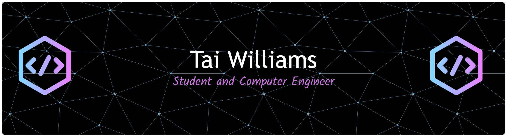

### Languages

### Frameworks

### Developer Tools

### Connect with Me!

  

<!---
TWilliamsA7/TWilliamsA7 is a ✨ special ✨ repository because its `README.md` (this file) appears on your GitHub profile.
You can click the Preview link to take a look at your changes.
--->
